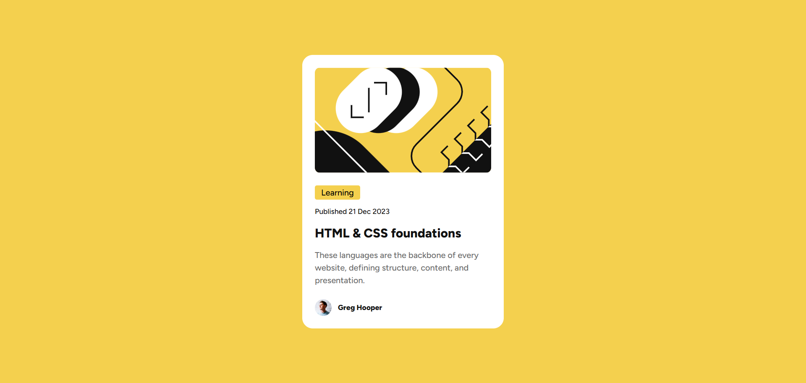

# Frontend Mentor - Blog preview card solution

This is a solution to the [Blog preview card challenge on Frontend Mentor](https://www.frontendmentor.io/challenges/blog-preview-card-ckPaj01IcS). Frontend Mentor challenges help you improve your coding skills by building realistic projects.

## Table of contents

- [Overview](#overview)
  - [The challenge](#the-challenge)
  - [Screenshot](#screenshot)
  - [Links](#links)
- [My process](#my-process)
  - [Built with](#built-with)
  - [What I learned](#what-i-learned)
  - [Useful resources](#useful-resources)
- [Author](#author)
- [Acknowledgments](#acknowledgments)

**Note: Delete this note and update the table of contents based on what sections you keep.**

## Overview

### The challenge

Users should be able to:

- See hover and focus states for all interactive elements on the page

### Screenshot



### Links

- Solution URL: [View solution](https://github.com/trevorcj/frontend-mentor-blog-preview-card)
- Live Site URL: [Visit 🚀](https://trevorcj-blog-preview-card.netlify.app/)

## My process

### Built with

- Semantic HTML5 markup
- CSS custom properties
- Flexbox

### What I learned

I learned how to use a self-hosted (local) font. I'd normally use Google fonts but I decided to try using the font in the `fonts` folder.

```css
@font-face {
  font-family: "Figtree";
  src: url("./assets/fonts/static/Figtree-Medium.ttf") format("truetype");
  font-weight: 500;
  font-style: normal;
}

@font-face {
  font-family: "Figtree";
  src: url("./assets/fonts/static/Figtree-ExtraBold.ttf") format("truetype");
  font-weight: 800;
  font-style: normal;
}
```

### Useful resources

- [Self-Hosting Web Font Files](https://medium.com/going-fullstack/self-hosting-web-font-files-6a46bfc36ffd) - This helped me to use a self-hosted font in the project.

## Author

- LinkedIn - [Connect on LinkedIn](https://www.linkedin.com/in/trevorcjustus/)
- Frontend Mentor - [@trevorcj](https://www.frontendmentor.io/profile/trevorcj)
- Twitter - [@trevoppa](https://x.com/trevoppa)

## Acknowledgments

Thanks to the Frontend Mentor community for their support and feedback throughout this challenge. It was a great learning experience!
